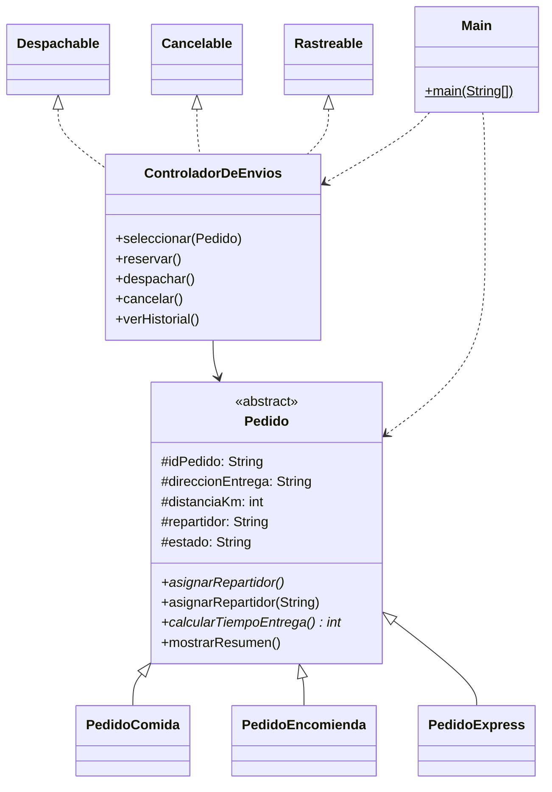

# Actividad Sumativa – Semana 3
## Desarrollo Orientado a Objetos II

**Diseñando un sistema orientado a objetos con clases abstractas, polimorfismo e interfaces**

---

## Autor del proyecto

- **Nombre completo:** Juan Bonilla
- **Carrera:** Analista Programador Computacional
- **Sede:** Online

---

## Descripción general del sistema

Esta carpeta es la versión integral de **SpeedFast**, el prototipo de reparto a domicilio en Java. Se mantiene la jerarquía de pedidos de comida, encomienda y compras express y se suman asignación de repartidor, interfaces de operación y un controlador de envíos.

Cada tipo de pedido sigue calculando su tiempo con la regla de las semanas anteriores:

- **Comida:** 15 min base + 2 min por kilómetro.
- **Encomienda:** 20 min base + 1.5 min por kilómetro (entero).
- **Express:** 10 min base y 5 min extra si la distancia supera 5 km.

La asignación automática también cambia según el tipo. En comida se asigna Luis Díaz o Pedro Rivas según la distancia, encomienda queda con Daniela Tapia y express con Carla Núñez o Soto Express. La sobrecarga `asignarRepartidor(String nombre)` deja un repartidor a mano, como en el ejemplo de consola de la pauta.

---

## Estructura del proyecto

### Paquete `speedfast`

- **`Pedido`** *(abstracta)*: atributos comunes, `mostrarResumen()`, `calcularTiempoEntrega()` abstracto, `asignarRepartidor()` abstracto y `asignarRepartidor(String nombre)` sobrecargado.
- **`PedidoComida`**, **`PedidoEncomienda`**, **`PedidoExpress`**: sobrescriben tiempo y asignación automática.
- **`Despachable`**, **`Cancelable`**, **`Rastreable`**: `despachar()`, `cancelar()`, `verHistorial()`.
- **`ControladorDeEnvios`**: implementa las tres interfaces, reserva, despacha, cancela y guarda el historial en un `ArrayList`.
- **`Main`**: simula asignación automática y manual, tiempos, reserva, despacho, cancelación e historial.

### Diagrama de clases

Archivo `diagrama-clases.puml` (PlantUML). La misma vista en Mermaid:



---

## Conceptos aplicados

- **Clase abstracta:** `Pedido` no se instancia. Deja `mostrarResumen()` listo y obliga a las subclases a definir tiempo y asignación automática.
- **Sobrescritura:** `asignarRepartidor()` y `calcularTiempoEntrega()` en cada subclase.
- **Sobrecarga:** `asignarRepartidor()` sin parámetros y `asignarRepartidor(String nombre)` en la clase base.
- **Polimorfismo:** un `Pedido[]` ejecuta el cálculo y la asignación que corresponde a cada tipo.
- **Interfaces:** `Despachable`, `Cancelable` y `Rastreable` en `ControladorDeEnvios` para no mezclar esas operaciones con el modelo del pedido.

### Escalabilidad, reutilización y mantenibilidad

La jerarquía deja entrar otro tipo de pedido (por ejemplo un cuarto envío) creando una subclase. No hay que reescribir `Main` ni el controlador para el cálculo de tiempo.

`mostrarResumen()` y la sobrecarga manual se reutilizan en todas las subclases. Las fórmulas de tiempo de las semanas previas se conservan en las mismas clases.

La mantenibilidad mejora porque despachar, cancelar y el historial viven en el controlador. Si cambia la regla de cancelación se toca una clase, no las tres de pedido.

---

## Instrucciones para clonar y ejecutar el proyecto

```bash
git clone https://github.com/JMDevx/OOD-2.git
cd OOD-2
```

Abrir en **IntelliJ IDEA** la carpeta `semana 3`. Marcar `src` como *source root* si no queda reconocida. Ejecutar `Main.java` del paquete `speedfast`.

Desde terminal, dentro de `semana 3`:

```bash
javac -encoding UTF-8 -d out src/speedfast/*.java
java -cp out speedfast.Main
```

---

## Tecnologías utilizadas

- Java
- IntelliJ IDEA
- Clases abstractas
- Polimorfismo (sobrescritura y sobrecarga)
- Interfaces
- ArrayList

---

© Duoc UC | Escuela de Informática y Telecomunicaciones
