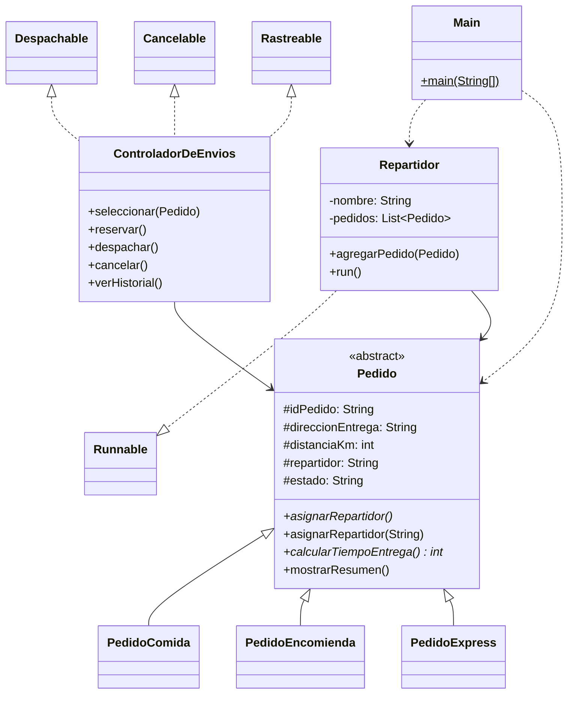

# Actividad Formativa – Semana 4
## Desarrollo Orientado a Objetos II

**Ejecutando tareas en paralelo con hilos en Java**

---

## Autor del proyecto

- **Nombre completo:** Juan Bonilla
- **Carrera:** Analista Programador Computacional
- **Sede:** Online

---

## Descripción general del sistema

Esta carpeta contiene la versión de **SpeedFast** correspondiente a la semana 4. Se extiende el sistema de reparto construido en semanas anteriores incorporando programación concurrente: cada repartidor se ejecuta como un hilo independiente que procesa su lista de pedidos de forma paralela.

El modelo de pedidos se mantiene sin cambios:

- **Comida:** 15 min base + 2 min por kilómetro.
- **Encomienda:** 20 min base + 1.5 min por kilómetro (entero).
- **Express:** 10 min base y 5 min extra si la distancia supera 5 km.

---

## Estructura del proyecto

### Paquete `speedfast`

**Clases previas (semanas 1–3, sin modificaciones):**
- **`Pedido`** *(abstracta)*: atributos comunes, `mostrarResumen()`, `calcularTiempoEntrega()` abstracto, `asignarRepartidor()` abstracto y `asignarRepartidor(String nombre)` sobrecargado.
- **`PedidoComida`**, **`PedidoEncomienda`**, **`PedidoExpress`**: sobrescriben tiempo y asignación automática.
- **`Despachable`**, **`Cancelable`**, **`Rastreable`**: interfaces de operación.
- **`ControladorDeEnvios`**: implementa las tres interfaces, reserva, despacha, cancela y guarda historial.

**Clase nueva (semana 4):**
- **`Repartidor`**: implementa `Runnable`. Tiene un nombre y una lista de pedidos. Su método `run()` entrega los pedidos secuencialmente, simulando el tiempo de traslado con `Thread.sleep()` y valores aleatorios generados con `ThreadLocalRandom`.

**Clase actualizada (semana 4):**
- **`Main`**: instancia tres repartidores con dos o más pedidos cada uno y los ejecuta en paralelo mediante `ExecutorService`.

---

## Diagrama de clases



---

## Conceptos aplicados

- **Thread / Runnable:** `Repartidor` implementa `Runnable` y define en `run()` la secuencia de entrega de sus pedidos. Separar la lógica de la tarea de la creación del hilo facilita el uso con `ExecutorService`.
- **ExecutorService:** en `Main` se usa `Executors.newFixedThreadPool(3)` para correr tres repartidores en paralelo. El pool gestiona la creación y ciclo de vida de los hilos.
- **Thread.sleep() / concurrencia:** cada repartidor pausa su hilo entre 500 y 2 000 ms por pedido con `ThreadLocalRandom`, lo que simula tiempos de traslado reales y provoca que los mensajes de distintos repartidores se intercalen en consola.
- **Manejo de InterruptedException:** capturada tanto en `run()` como en `awaitTermination()` para que el programa no falle si algún hilo es interrumpido.
- **Polimorfismo:** la lista de `Repartidor` declara `List<Pedido>`, por lo que admite cualquier subclase sin cambios.
- **Clase abstracta e interfaces:** `Pedido`, `Despachable`, `Cancelable` y `Rastreable` se reutilizan intactos desde semanas anteriores.

### Sobre escalabilidad, reutilización y mantenibilidad

Agregar un cuarto tipo de pedido sigue sin requerir cambios en `Repartidor` ni en `Main`. La clase `Repartidor` es genérica respecto al tipo de pedido. Si en el futuro se quiere cambiar la estrategia de concurrencia (por ejemplo pasar a un pool de tamaño variable) solo se modifica la línea de `Executors` en `Main`.

---

## Ejemplo de salida en consola

El orden de los mensajes varía en cada ejecución porque los hilos corren en paralelo.

```
[Repartidor: Camila] Entregando PedidoComida #101...
[Repartidor: Luis] Entregando PedidoExpress #102...
[Repartidor: Daniela] Entregando PedidoEncomienda #103...
[Repartidor: Luis] Pedido #102 entregado.
[Repartidor: Camila] Pedido #101 entregado.
[Repartidor: Luis] Entregando PedidoComida #105...
[Repartidor: Camila] Entregando PedidoEncomienda #104...
[Repartidor: Daniela] Pedido #103 entregado.
[Repartidor: Daniela] Entregando PedidoExpress #106...
[Repartidor: Luis] Pedido #105 entregado.
[Repartidor: Camila] Pedido #104 entregado.
[Repartidor: Daniela] Pedido #106 entregado.

Todas las entregas han finalizado.
```

---

## Instrucciones para ejecutar el proyecto

```bash
git clone https://github.com/JMDevx/OOD-2.git
cd OOD-2
```

Abrir en **IntelliJ IDEA** la carpeta `semana 4`. Marcar `src` como *source root* si no queda reconocida. Ejecutar `Main.java` del paquete `speedfast`.

Desde terminal, dentro de la carpeta del proyecto:

```bash
javac -encoding UTF-8 -d out src/speedfast/*.java
java -cp out speedfast.Main
```

---

## Tecnologías utilizadas

- Java
- IntelliJ IDEA
- Programación concurrente: `Thread`, `Runnable`, `ExecutorService`
- Clases abstractas y polimorfismo
- Interfaces
- `ArrayList`

---

© Duoc UC | Escuela de Informática y Telecomunicaciones
